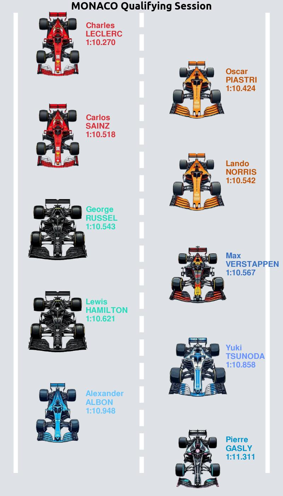
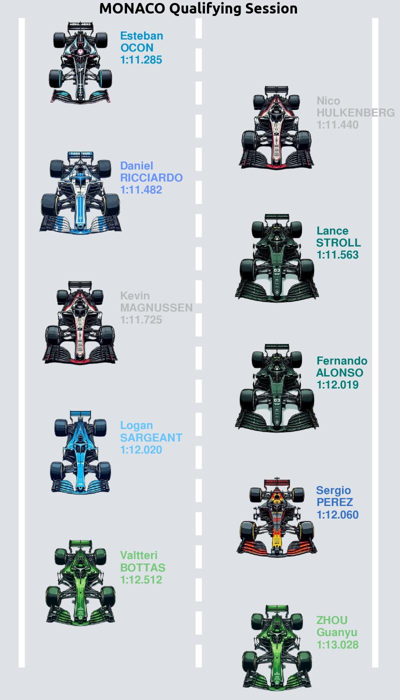
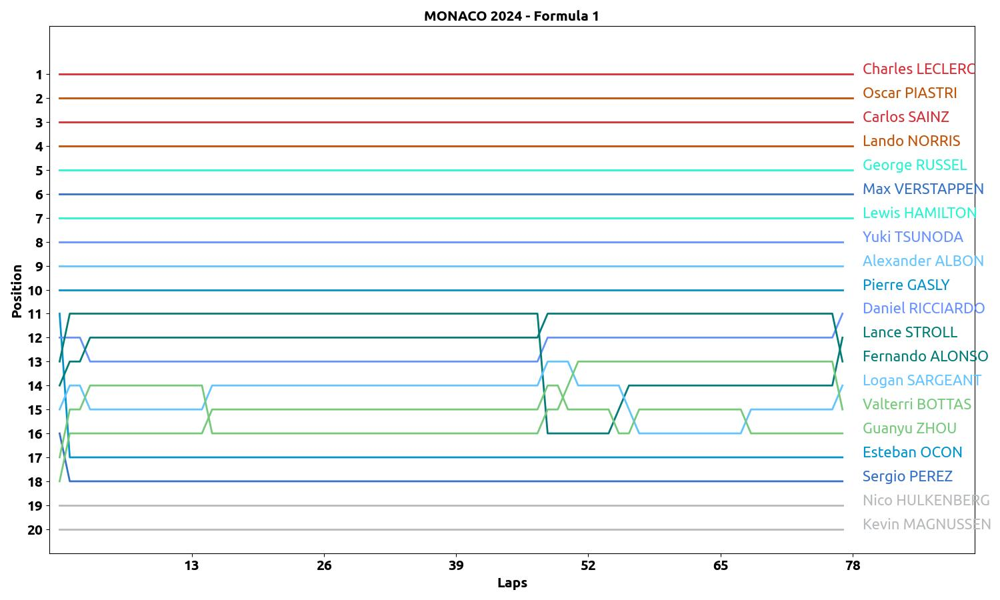

# RACE STATS ABOUT MOTOGP, MOTO2, MOTO3 AND F1

## USING

- for motoGP, moto2 and moto3
    - make folder with race name and year 
    - download pdf files (Analysis.pdf, LapChart.pdf, FastLapRider.pdf, worldstandings) from official motogp site about any race
    - start py scripts (you need to change name of race, year and number of races in world_standings.py)

- for formula 1
    - make folder with race name and year
    - download files (Lap_Chart.pdf, Lap_Times.pdf, Qualification.pdf) from official fia site
    - start py scripts (you need to change name of race, year and number of races in world_standings.py)

## RESULTS

- lap analyses

- lap chart

<video controls src="MUGELLO_2024/LapChart.mp4" title="motoGP Lap Chart"></video>

- world standings

<video controls src="MUGELLO_2024_MOTO_3/World_standings.mp4" title="moto3 World Standings"></video>

- qualification f1

- race chart

